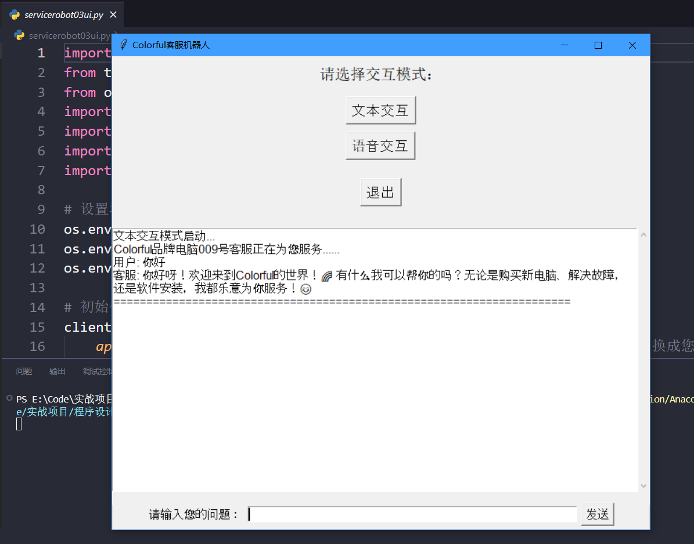
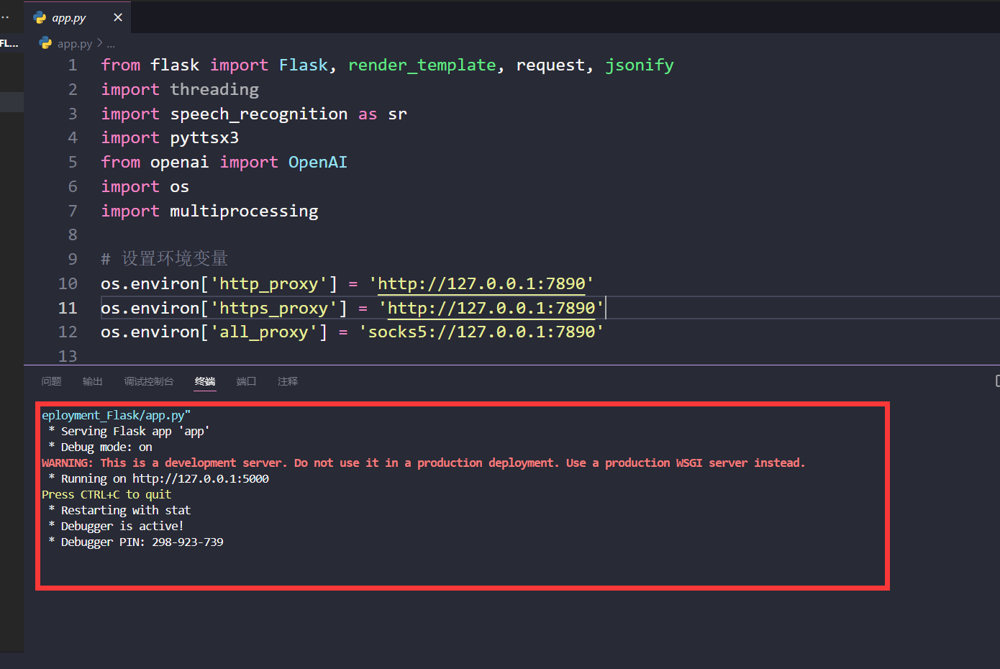
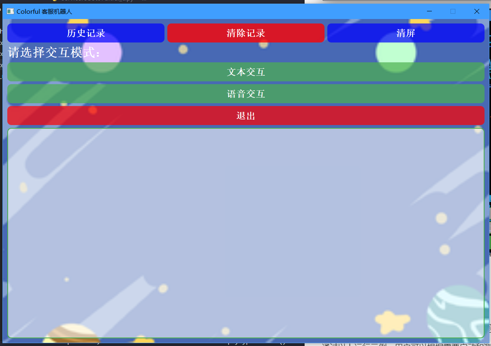

# 简易客服机器人用户手册

**版本**: 1.0  
**开发人员**: 20223430 何文轩  
**日期**: 2024年8月22日	

---

## 1. 软件功能说明

本项目”简易客服机器人“是为Colorful笔记本电脑客户服务而开发的一款智能化客服系统。随着人工智能技术的快速发展，智能客服系统在企业中的应用变得越来越普遍。本项目的目标是通过文本和语音交互为用户提供服务，同时具备多线程处理、图形用户界面（GUI）、数据库管理以及Web部署等功能。通过整合多种技术，本项目不仅旨在提升用户体验，还希望探索前沿技术的应用，打造一个功能全面且智能化的客户服务解决方案。

该系统基于OpenAI的`GPT-4o`模型，充分利用了其强大的通用能力，并通过精细的提示词微调，使其能够为用户提供精准且高效的解决方案。系统支持文本与语音的双模态交互，并通过PyQt5实现直观友好的图形用户界面，提升了用户操作的便捷性与舒适度。

在项目的==第五个==版本中，引入了基于Flask框架的Web前端，并结合HTML、CSS和JavaScript技术，进一步增强了系统的交互性与美观性。Web端的加入使得系统能够跨平台运行，满足不同用户的访问需求。通过这些技术的结合，简易客服机器人不仅提升了服务质量，也为未来的技术扩展打下了坚实基础。

### 主要功能：

- **文本交互**：支持通过命令行和GUI进行文本输入与对话。
- **语音交互**：集成语音识别和合成功能，实现用户的语音交互需求。
- **图形用户界面**：通过PyQt5实现桌面端用户界面，提供丰富的操作选项。
- **数据管理**：使用SQLite数据库记录并管理用户交互数据。
- **多线程处理**：在高并发环境下保障系统的响应速度与稳定性。
- **Web部署**：通过Flask框架搭建Web前端，实现跨平台访问。
- **智能问答**：基于`GPT-4o`模型的强大推理与处理能力，提供智能问答服务。

---

## 2. 环境搭建

### 2.1 开发环境

| 类型         | 工具与环境                                                   |
| ------------ | ------------------------------------------------------------ |
| 开发工具     | Visual Studio Code (Vscode), Anaconda, Git                   |
| 运行环境     | Windows 10, Ubuntu 20.04                                     |
| 编程语言     | Python 3.8 (基于 Anaconda 环境), JavaScript, HTML, CSS       |
| 技术框架与库 | PyQt5, SpeechRecognition, OpenAI API, pygame, pyttsx3, Flask |
| 数据库       | SQLite                                                       |
| 版本管理     | Git, GitHub                                                  |

### 2.2 组件描述

本系统的核心组件包括：

- **PyQt5**: PyQt5 是一个用于构建跨平台桌面应用程序的 Python 库，提供了丰富的 GUI 控件和功能。本项目使用 PyQt5 构建了用户友好的桌面端界面，使用户能够通过直观的图形界面与系统进行交互。

- **Flask**: Flask 是一个轻量级的 Web 框架，适用于构建快速而灵活的 Web 应用。本项目在第五个版本中使用 Flask 实现了 Web 端功能，结合 HTML、CSS 和 JavaScript 技术，提供跨平台的用户访问能力，允许用户通过浏览器与系统互动。

- **SpeechRecognition**: SpeechRecognition 是一个用于将语音转换为文本的 Python 库，支持多种语音识别引擎。本项目使用该库处理用户的语音输入，实现了语音识别功能，使用户可以通过语音与系统进行互动。

- **openai**: OpenAI 提供的 GPT-4o 模型是一个功能强大的自然语言处理模型，能够理解和生成类人文本。本项目集成了 GPT-4o 模型，通过其强大的推理能力和提示词微调，提供精准且高效的智能问答和推理功能。

- **pygame**: Pygame 是一个用于开发多媒体应用的 Python 库，尤其适用于处理音频和图像。本项目使用 Pygame 负责播放背景音乐和音效，增强用户的沉浸式体验，使系统更加生动和互动。

- **pyttsx3**: pyttsx3 是一个跨平台的文本转语音（TTS）库，支持多种 TTS 引擎。本项目使用 pyttsx3 实现了文本转语音功能，使系统能够通过语音反馈用户的请求，提供更自然的交互体验。

- **SQLite**: SQLite 是一个轻量级的嵌入式关系数据库，适用于存储和管理小型数据集。本项目使用 SQLite 作为后台数据库，存储用户的交互数据，并支持历史记录的持久化和查询功能。

### 2.3 源代码、资源及数据清单

项目的目录结构如下：

<div style="background-color: #f0f8ff; padding: 0px; border: 2px solid #ccc;">
    <pre>
.
├── 01_Text_Interaction_Terminal
│   └── servicerobot01text.py
├── 02_Voice_Interaction_Terminal
│   └── servicerobot02voice.py
├── 03_UI_Interaction_Mode
│   └── servicerobot03ui.py
├── 04_Multithreading_Efficiency_Optimization
│   └── servicerobot04threading.py
├── 05_Web_Deployment_Flask
│   ├── static
│   │   └── images
│   ├── templates
│   └── app.py
├── 06_Database_Conversation_History
│   ├── resources
│   ├── __pycache__
│   └── servicerobot06history.py
├── 07_Ultral_Version
│   ├── audio
│   ├── imgs
│   └── servicerobot07ultral_c.py
└── preTests
    </pre>
</div>

下面对各目录详尽的说明：

- **01_Text_Interaction_Terminal**:  
  存放文本交互模块的源代码文件，`servicerobot01text.py` 实现了基础的文本交互功能，支持用户通过命令行进行对话。
- **02_Voice_Interaction_Terminal**:  
  存放语音交互模块的源代码文件，`servicerobot02voice.py` 实现了语音识别和语音合成功能，支持用户通过语音与系统进行互动。
- **03_UI_Interaction_Mode**:  
  存放图形用户界面模块的源代码文件，`servicerobot03ui.py` 使用 PyQt5 实现了桌面端的图形用户界面，为用户提供直观的操作体验。
- **04_Multithreading_Efficiency_Optimization**:  
  存放多线程处理模块的源代码文件，`servicerobot04threading.py` 通过引入多线程技术提升了系统的响应速度和处理效率。
- **05_Web_Deployment_Flask**:  
  存放 Web 部署相关文件。使用 Flask 框架实现，包含前端和后端文件：
  - **/static/images/**: 存放静态资源文件，如图像。
  - **/templates/**: 存放 HTML 模板文件，用于前端展示。
  - `app.py`: Flask 应用的主文件，处理 Web 请求和 API 接口。
- **06_Database_Conversation_History**:  
  存放聊天记录管理模块的源代码和相关资源：
  - **/resources/**: 包含数据库操作所需的资源文件。
  - **/__pycache__/**: 存放编译后的 Python 字节码文件。
- **07_Ultral_Version**:  
  存放最终优化版本的源代码和资源文件：
  - **/audio/**: 存放背景音乐和音效文件。
  - **/imgs/**: 存放用户界面使用的图片和图标资源。
- **preTests**:  
  存放项目开发过程中进行的测试文件和脚本，用于功能验证和性能测试。 

通过这些目录和文件，系统实现了全面的功能模块化，确保各个组件能够独立开发、测试和维护。

## 3. 运行环境安装与配置

### 3.1 系统部署图

系统支持桌面端和Web端的双重访问方式，系统架构如下：


### 3.2 系统要求

本系统对运行环境的要求如下：

- **操作系统**：Windows 10 或 Ubuntu 20.04
- **内存**：至少 4GB 内存，推荐 8GB 以上
- **处理器**：支持64位的双核处理器，推荐i5及以上
- **存储空间**：至少 500MB 可用存储空间
- **Web浏览器**：支持现代浏览器（Chrome, Firefox, Edge）

### 3.3 系统安装与配置

本节将详细介绍如何在本地环境中安装和配置本项目，确保能够顺利运行项目的桌面端和Web端。

#### 1. **创建 Python 3.8 环境**

本项目基于 Python 3.8 进行开发，因此需要创建一个对应的 Anaconda 环境。用户可以执行以下命令创建并激活新环境：

```python
conda create -n servicerobot_env python=3.8
conda activate servicerobot_env
```

#### 2. **安装项目依赖**

在激活环境后，进入项目的根目录并安装项目依赖。首先，确保 `requirements.txt` 文件位于项目根目录下，然后运行以下命令：

```python
pip install -r requirements.txt
```

此命令将自动安装项目所需的所有Python库和包，包括 PyQt5、Flask、SpeechRecognition、OpenAI API 等。

用户也可以手动安装这些依赖，下面是整个项目所需的依赖库：

```python
PyQt5==5.15.9
PyQt5_sip==12.15.0
SpeechRecognition==3.10.4
openai==1.37.1
pygame==2.6.0
pyttsx3==2.90
```

#### 3. **启动系统**

根据需要启动桌面端或Web端：

- **桌面端运行**：

  - 进入项目目录并运行以下命令启动桌面端的 PyQt5 应用

    ```python
    python servicerobot07ultral_c.py
    ```

  启动后，用户将看到图形用户界面，可以通过该界面与系统进行交互。

- **Web端运行**：

  - 进入项目目录并运行 `app.py` 文件以启动 Flask 服务器：

    ```python
    python app.py
    ```

  - 服务器启动后，打开浏览器并访问以下地址：

    ```python
    http://localhost:5000
    ```

    此时，用户将可以通过Web界面与系统进行交互。

## 4. 用户操作说明

### 4.1 系统组成

简易客服机器人由以下几个主要模块组成，涵盖了系统的核心功能，确保用户能够通过多种交互方式获得智能化的服务体验。

1. **文本交互模块**：
   - 支持用户通过命令行或GUI输入文本与系统进行交互。该模块采用Python实现，能够快速处理用户输入，并通过`GPT-4o`生成智能回复。文本交互模块是系统的基础部分，确保系统能够准确、快速地理解和响应用户的文本输入需求。

2. **语音交互模块**：
   - 支持用户通过语音输入与系统交流。系统调用了谷歌的语音识别服务，将用户的语音转换为文本，再利用`GPT-4o`模型生成响应，并通过语音合成技术将回复反馈给用户。该模块使得系统能够理解和处理用户的语音输入，实现更自然的交互方式，为用户提供更加便捷的体验。

3. **图形用户界面模块**：
   - 通过PyQt5构建桌面端GUI，提供用户友好的操作界面。用户可以通过点击按钮、输入文本或语音指令等方式与系统互动。该模块确保系统具备直观、易用的操作界面，提升了整体的用户体验，使用户能够轻松访问系统的各项功能。

4. **Web界面模块**：
   - 基于Flask框架，结合HTML、CSS、JavaScript技术，为用户提供跨平台的Web访问方式。用户可以通过浏览器访问系统，享受与桌面端类似的交互体验。Web界面模块使得系统能够在多个平台上运行，拓展了用户的使用场景，提供了更大的灵活性和便利性。

5. **数据管理模块**：
   - 使用SQLite数据库记录和管理用户的交互数据，支持历史记录的持久化存储与查询。该模块确保用户的交互数据能够安全存储，便于日后查询和分析。通过数据管理模块，系统能够实现数据的持久化保存，增强系统的可靠性和功能性。

这些模块共同构成了简易客服机器人的核心架构，确保系统在不同场景下都能为用户提供高效、智能的服务体验。

### 4.2 运行示例

本节详细说明如何运行简易客服机器人系统中的各个模块，并介绍各个目录的作用。根据项目的实际结构，以下是具体的运行示例和目录说明。

#### 4.2.1 文本交互模块

**目录**：`01_Text_Interaction_Terminal`

**说明**：该目录下包含用于实现基础文本交互功能的源代码文件。文本交互模块是系统的核心部分，允许用户通过命令行输入文本与系统进行交互。模块通过调用`GPT-4o`生成智能回复，能够快速处理用户的文本输入，适合在无图形界面的情况下运行。

**运行命令**：

```python
python servicerobot01text.py
```


> 开发者也提供了演示视频，具体可以在 `03_项目关闭总结报告\产品运行视频` 中查看。

#### 4.2.2 语音交互模块

**目录**：`02_Voice_Interaction_Terminal`

**说明**：该目录实现了语音交互功能，用户可以通过语音与系统进行交流。系统通过谷歌语音识别服务将语音转换为文本，再利用`GPT-4o`模型生成响应，并通过语音合成将回复反馈给用户。这一模块在文本交互的基础上增强了用户体验。

**运行命令**：

```python
python servicerobot02voice.py
```


> 开发者也提供了演示视频，具体可以在 `03_项目关闭总结报告\产品运行视频` 中查看。

#### 4.2.3 图形用户界面模块

**目录**：`03_UI_Interaction_Mode`

**说明**：该目录使用==Tkinter==实现了基本的图形用户界面（GUI），提供了更直观的用户交互方式。虽然界面设计相对简陋，但功能完备，支持用户通过按钮、文本框等控件与系统进行交互，是一个完善的功能实现版本。

**运行命令**：

```python
python servicerobot03ui.py
```



> 开发者也提供了演示视频，具体可以在 `03_项目关闭总结报告\产品运行视频` 中查看。

#### 4.2.4 多线程优化模块

**目录**：`04_Multithreading_Efficiency_Optimization`

**说明**：该目录的源代码通过引入多线程技术，对系统的响应速度和处理效率进行了优化。之前的单线程实现中，当用户发送消息时，系统会被阻塞，直到回复生成完毕。通过引入多线程，系统能够在后台处理回复的同时，允许用户继续发送消息，从而实现更流畅的交互体验。

**运行命令**：

```python
python servicerobot04threading.py
```

==文本模式多线程==的实现：

```python
    def send_query(self):
        query = self.input_entry.get()
        if query:
            self.append_dialog("用户: " + query)
            threading.Thread(target=self._process_text_query, args=(query,)).start()
            self.input_entry.delete(0, tk.END)

    def _process_text_query(self, query):
        result = chat(query)
        self.append_dialog("客服: " + result)
        self.append_dialog("=" * 70)  # 添加分割线
```

==语音模式多线程==的实现：

```python
    # 多线程处理第一个初始语音提示
    def speak_text_initial(self):
        threading.Thread(target=speak_text, args=("Colorful品牌电脑009号客服正在为您服务......请问有什么可以帮助您的？",)).start()
    
    # 多线程处理接下来的语音识别和语音合成任务
    def speak_query(self):
        threading.Thread(target=self._process_voice_query).start()

    def _process_voice_query(self):
        query = recognize_speech_from_mic()
        if query:
            self.append_dialog("用户: " + query)
            result = chat(query)
            self.append_dialog("客服: " + result)
            self.append_dialog("=" * 70)  # 添加分割线
            threading.Thread(target=speak_text, args=(result,)).start()
```

> 开发者也提供了演示视频，具体可以在 `03_项目关闭总结报告\产品运行视频` 中查看。

#### 4.2.5 Web界面模块

**目录**：`05_Web_Deployment_Flask`

**说明**：该目录下的代码使用Flask框架实现了Web界面，结合HTML、CSS和JavaScript技术，使系统可以跨平台运行。用户可以通过浏览器访问系统，进行文本和语音交互，适用于需要远程访问或跨设备操作的场景。

**运行命令**：
```python
python app.py
```



浏览器访问 `http://localhost:5000`。


> 开发者也提供了演示视频，具体可以在 `03_项目关闭总结报告\产品运行视频` 中查看。

#### 4.2.6 聊天记录管理模块

**目录**：`06_Database_Conversation_History`

**说明**：该目录下的代码实现了用户交互记录的持久化存储与管理。系统使用SQLite数据库记录用户的文本和语音交互数据，支持历史记录的查询和导出功能。这一模块增强了系统的数据管理能力，确保用户的交互数据能够长期保存。

**运行命令**：
```python
python servicerobot06history.py
```


> 开发者也提供了演示视频，具体可以在 `03_项目关闭总结报告\产品运行视频` 中查看。

#### 4.2.7 最终优化版本

**目录**：`07_Ultral_Version`

**说明**：该目录下的 `servicerobot07ultral_c.py` 是系统的最终优化版本。该版本采用了PyQt5进行艺术化设计，不仅具备动态背景和背景音乐，还新设计了登录页面，进一步提升了用户体验。相比前面的版本，该版本在美观性和功能性上都达到了新的高度，是整个项目的集大成者。

**运行命令**：
```python
python servicerobot07ultral_c.py
```





> 开发者也提供了演示视频，具体可以在 `03_项目关闭总结报告\产品运行视频` 中查看。

## 5. 数据库详细说明

### 5.1 数据库概述

简易客服机器人系统使用SQLite作为数据库管理系统。SQLite是一种轻量级的嵌入式关系数据库管理系统，适用于存储小型数据集。它无需单独的服务器进程，因此非常适合于桌面应用程序和小型Web应用程序。

系统使用SQLite数据库来持久化存储用户的文本和语音交互记录，确保用户的历史记录能够随时查询。

### 5.2 数据库结构

系统的数据库结构设计如下：

- **数据库名称**：`servicerobot.db`
- **主要数据表**：`conversation_history`

### 5.3 数据表说明

**表名**：`conversation_history`

| 字段名称       | 数据类型 | 描述                             |
| -------------- | -------- | -------------------------------- |
| `id`           | INTEGER  | 主键，自增                       |
| `user_input`   | TEXT     | 用户输入的文本或语音转文本的内容 |
| `bot_response` | TEXT     | 系统生成的回复内容               |
| `timestamp`    | DATETIME | 交互发生的时间                   |

### 5.4 数据库结构图


### 5.5 数据库操作

系统没有内置的导出功能，但管理员或用户可以使用`Navicat`或类似的数据库管理工具来查看和操作数据库中的数据。通过这些工具，用户可以轻松地查询、编辑或导出交互数据，以便进行进一步的分析或存档。

### 5.6 数据备份与恢复

系统支持数据库的备份和恢复操作，以确保数据安全。管理员可以通过以下步骤备份和恢复数据库：

1. **备份**：
   - 复制 `servicerobot.db` 文件到安全的存储位置即可完成备份。
2. **恢复**：
   - 如果需要恢复数据，只需将备份的 `servicerobot.db` 文件替换系统中的同名文件即可。

## 6. 与我们取得联系

如果您在使用简易客服机器人过程中遇到任何问题，或者有任何建议和反馈，欢迎通过以下方式与我们联系：

- **邮箱**: xixiwenxuanhe@outlook.com
- **QQ**: 2212266755

我们将竭诚为您提供帮助，并不断改进系统，以提升用户体验。

### 版权声明

简易客服机器人 © 2024 何文轩 保留所有权利。

本项目为开源项目，代码和文档可用于学习、研究和个人使用，但禁止用于任何商业用途。未经作者书面许可，任何个人或组织不得将本项目用于商业活动。